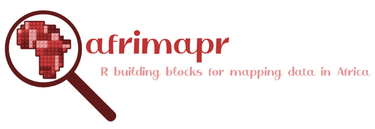

# Meet Sam
Sam does science in a lab, and is what many people might think of as a "traditional" scientist. 

# Now meet Joy
Joy works in the same area as Sam, but writes computer code to do their work, a **non-traditional academic output**. 

<a href="https://www.freepik.com/vectors/people">People vector created by pikisuperstar - www.freepik.com</a>

# It's all ESSENTIAL
Say and Joy both do essential research work, but we'll be focusing on Joy, and some of the challenges they face: 

# Challenges for computational research

Missing computational **tools** for research, insufficient incentive to draw, retain, and reward **talent**, and insufficient **trust** in computational work. 

# Tools 
- Much research is so niche the computational tools needed may not exist, _and yet..._
- Sometimes it's the opposite, and tools are fragmented across many software tools and standards.

# Trust

A lot of tech has a **bad name** for a **good reason** - companies, governments, healthcare officials, and researchers don't always use people's data in trustworthy ways. 

# Talent
- Code is not papers 
- Good practice may not be directly appreciated (except by future you and other maintainers)

# Talent 
- May not be shared, or may not be open in spirit
- Researchers may (justifiably) feel the need to hide the code aspects of their work in a grant application, or not realise they are doing (or should be doing) software engineering / data science

# Talent 
- Diversity in software engineering is bad, diversity in open source is bad, as is diversity in research. We're at the intersection of these places! 
- ADD NPCH CITE

# Data for Science and Health

Our goal: To fund the Tools, Talent, Trust and make trustworthy data science a first-class citizen in the research ecosystem

# What Wellcome focuses on

The Wellcome Trust's strategy focuses on three primary areas, as well as a broader "discovery research" umbrella: 

- Global heating
- Mental health
- Infectious disease

# Open work we've (co-)funded so far

**AfriMapr**

Open source shiny-based tool that integrates healthcare facility locations and shows on a map. [github.com/afrimapr](https://github.com/afrimapr)

# Open work we've (co-)funded so far

**OpenSAFELY**

Open tool to make computational work across healthcare data secure and safe. [github.com/opensafely](https://github.com/opensafely/)

# Shining a spotlight on the **good**

Well-done software means focusing on maintainable code, but also on:

- Documentation (for users _and_ developers)
- Accessibility (in the sense of [a11y](https://www.a11yproject.com/), rather than [FAIR](https://www.go-fair.org/fair-principles/))
- Healthy and diverse community
- UX (User Experience)

# Interested / think there might be a good fit? 
We're curating a blog that highlights good practice in open source research. (LINK HERE)

Currently looking for:   
- Software to share
- Guest editors to help curate collections

# Interested / think there might be a good fit? 

If you have a project idea that you think might fit into our funding interests, [please contact us](https://wellcome.org/what-we-do/our-work/data-science-and-health-trustworthy-data-science)! 

My email: [y.yehudi@wellcome.org](mailto:y.yehudi@wellcome.org)  

The team: [ContactDataForScienceAndHealth@wellcome.org](mailto:ContactDataForScienceAndHealth@wellcome.org)

Twitter: [yoyehudi](https://twitter.com/yoyehudi)

